
 Kacper Grinholc 
 

 17.06.2022 

 <h1> Inteligencja obliczeniowa </h1> 

 <h2> Zadanie projektowe nr2 </h2> 

 <h3> Analiza tweetów na temat państw </h3> 

  

Z okresu 1.06.2021 do 30.05.2022 pobrano 200 tweetów dziennie w języku angielskim dla każdego z hashtagów: #Ukraine, #Russia, #Israel, #Poland oraz #Turkey.
Zrobiono wordcloud z tweetów podano je ocenie algorytmom z biblioteki vader oraz text2emotion i wyniki zaprezenotwano na wykresach.
  

 <h1> WordCloud </h1> 

 

W większości państw od lutego 2022 mówiło się o ukrainie oraz rosji, po za tym w większości państw widać, że głównym tematem jest polityka, dodatkowo w polsce w okresie czerwiec - wrzesień dużo tweetów zawierało słowa związane z grami np. steam, gaming, pcgaming, gamedev, gamingnews.

  

 <h1> Vader </h1> 

 

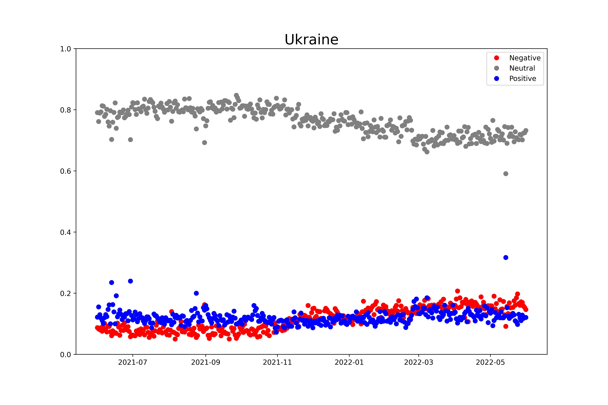

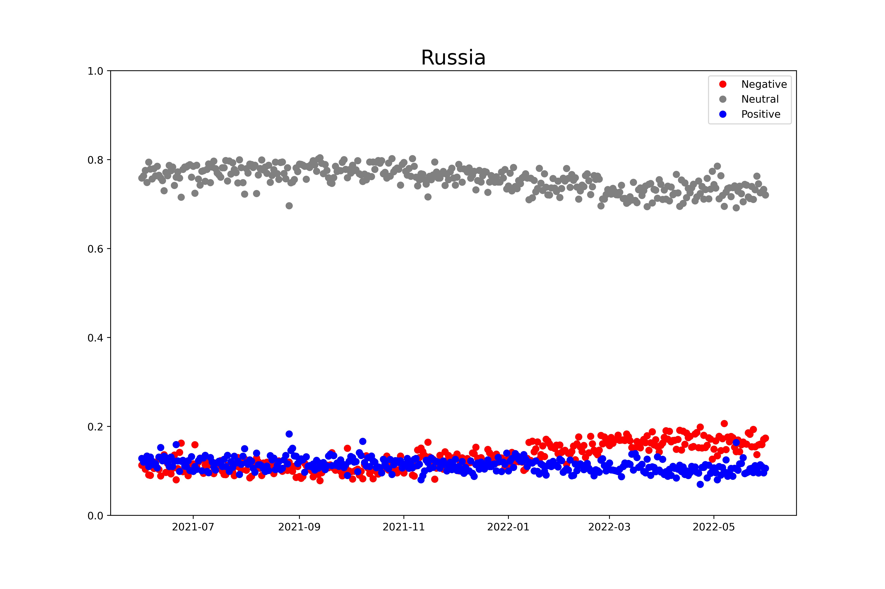

Dla Rosji oraz Ukrainy negatywnośc tweetów cały czas rosła, szczególnie od momentu rozpoczęcia wojny

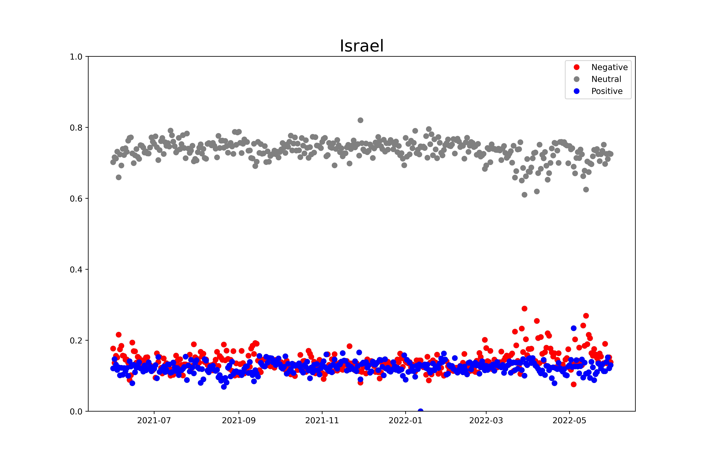

Dla Izraela negatywnośc wzrosła bardzo w kwietniu 2022 kiedy to wybuchły starcia między Izraelczykami a Palestyczykami

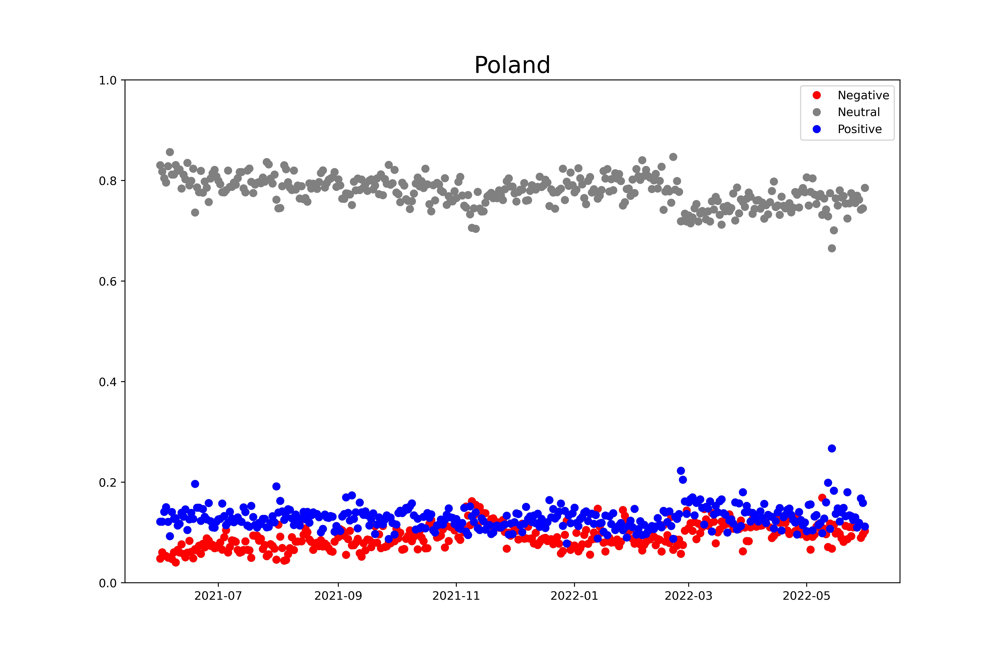

Dla Polski poziom tweetów raczej się nie zmieniał, zwiększył się tylko w listopadzie 2021 kiedy to uchodźcy próbowali wydostać się z białorusko-polskiej granicy

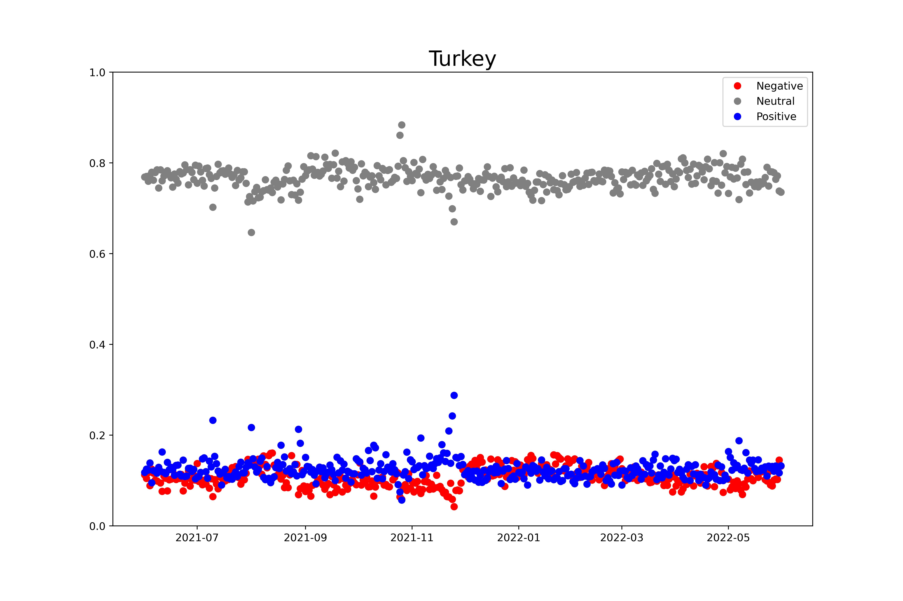

Dla Turcji tweety były również stałe przez większość czasu, jednak ilośc pozytywnych tweetów wzrosła wraz ze świętem dziękczynienia w USA

  

 <h1> Text2emotion </h1> 

 

 <h3> Ukraina </h3> 

 

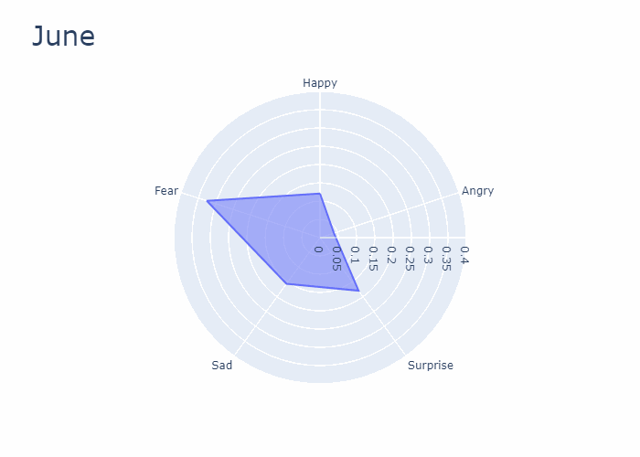

 <h3> Rosja </h3> 

 

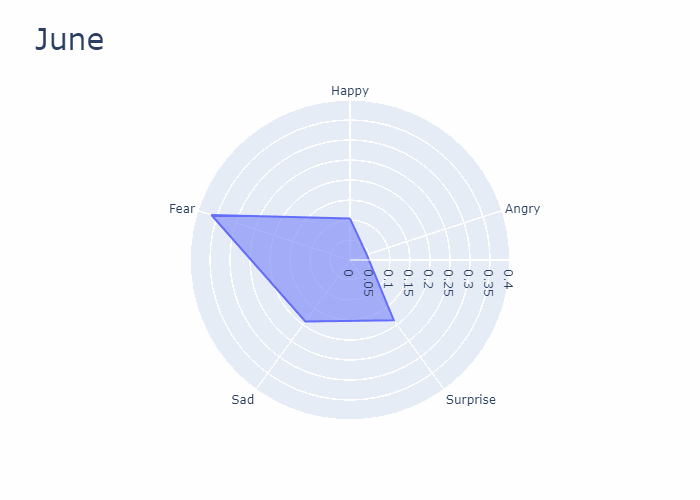

 <h3> Izrael </h3> 

 

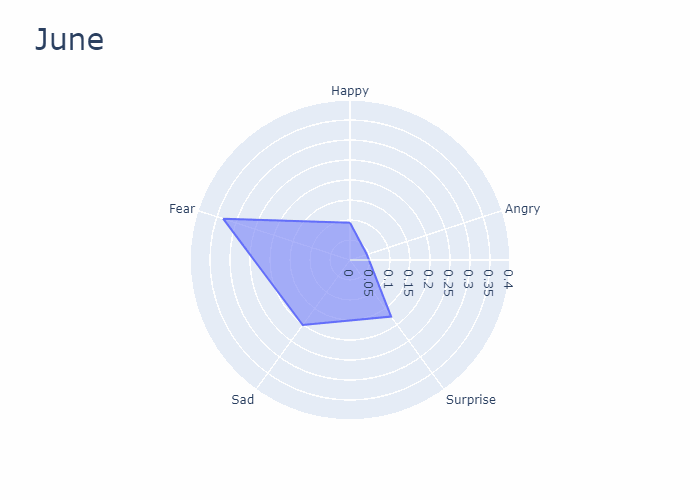

 <h3> Polska </h3> 

 

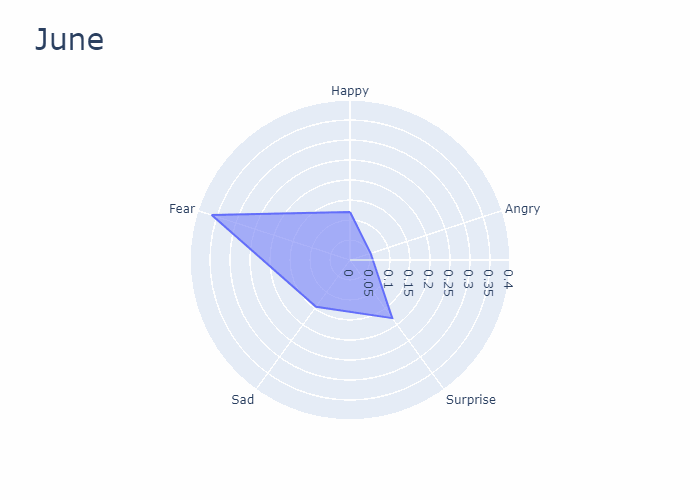

 <h3> Turcja </h3> 

 

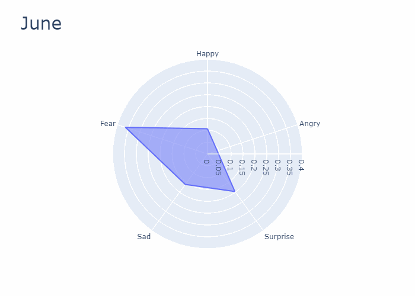

W większości państw dominuje strach ponieważ text2emotion słowa związane z polityką uznaje za słowa należące do tej kategorii. Dla losowych pobranych tweetów przeanalizowałem jakie słowa wywołują strach według tej biblioteki i oto niektóre z nich:

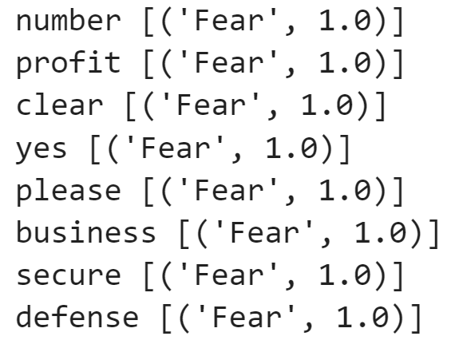

Wniosek jest taki, że żadna z tych bibliotek nie ocenia dobrze tekstu, może być to również spowodowany złymi danymi ponieważ uważam, że tweety nie są najlepszymi danymi do oceniania.

